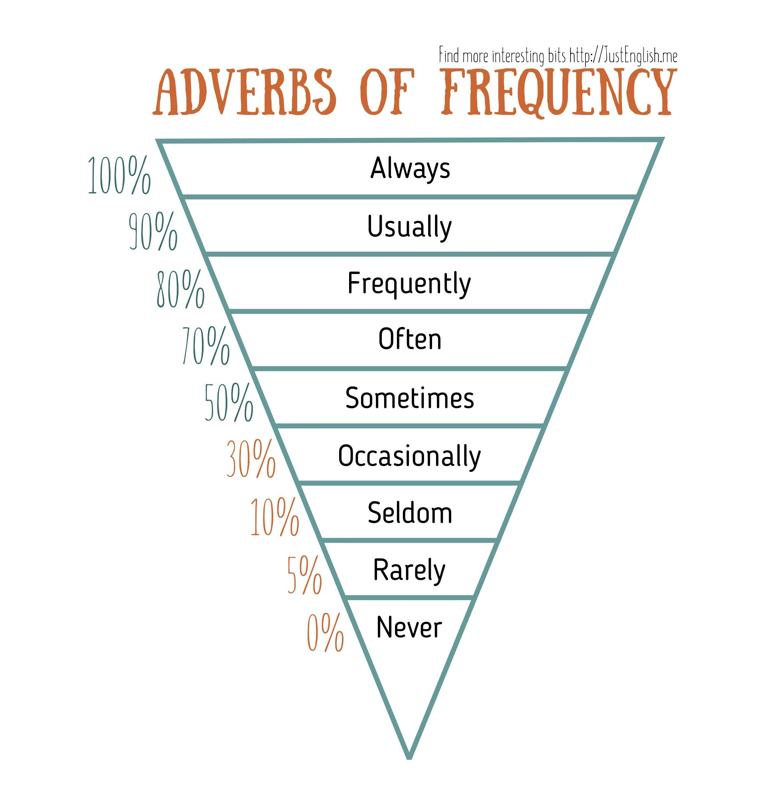
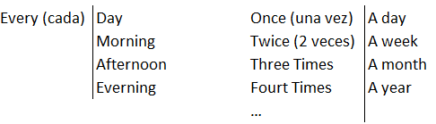

# Introducción a Ingles Nivel 1

**Información Cursada**
- Docente: Cristina Daniela
- Comisión: 37-5900 (Viernes noche)
- Alumno: Tiago Pujia
- Traductor: [Word Reference](https://www.wordreference.com/es/)

**Formato Evaluación**
- Varias Actividades 
- 1 Trabajo Practico
- 1° parcial escrito (modulo 1 y 2)
- 2° parcial oral

## Indice

- [Introducción a Ingles Nivel 1](#introducción-a-ingles-nivel-1)
  - [Indice](#indice)
- [Diccionario](#diccionario)
- [Gramatica de Adjetivos y Sustantivos](#gramatica-de-adjetivos-y-sustantivos)
- [Presente Continuo](#presente-continuo)
- [Expresar Existencia](#expresar-existencia)
- [Presente Simple](#presente-simple)
- [Comparación de Adjetivos](#comparación-de-adjetivos)
  - [Comparativo](#comparativo)
  - [Superlativo](#superlativo)
  - [Comparación con "as...as"](#comparación-con-asas)
- [Verbos Modales](#verbos-modales)
- [Pasado Simple](#pasado-simple)
- [Modo Imperativo](#modo-imperativo)
- [Uso del Should](#uso-del-should)
- [Frecuencia de Adverbios](#frecuencia-de-adverbios)
- [Expresiones de Frecuencia](#expresiones-de-frecuencia)
  - [Adjetivos Posesivos](#adjetivos-posesivos)
- [Hablar en Conversaciones](#hablar-en-conversaciones)
  - [Comienzo para dar una opinion](#comienzo-para-dar-una-opinion)
  - [Expresar acuerdo o desacuerdo](#expresar-acuerdo-o-desacuerdo)

---

# Diccionario

| Español                                                  | Inglés       | Pasado Simple           |
|----------------------------------------------------------|--------------|-------------------------|
| Alrededor de/como/hacia                                  | About        | Was/Were                |
| Habilidad/Capacidad                                      | Abilities    | Could                   |
| En contra                                                | Against      | Was/Were Against        |
| También/Además                                           | Also         | Also (no cambia)        |
| Responsable                                              | Attending    | Was Attending           |
| Asistir                                                  | Attend       | Attended                |
| Comenzar                                                 | Begin        | Began                   |
| Volverse/Convertirse                                     | Become       | Became                  |
| Creer                                                    | Believe      | Believed                |
| Ocultar/Callar                                           | Conceal      | Concealed               |
| Elegir                                                   | Choose       | Chose                   |
| Instituto                                                | College      | Did College             |
| Grado                                                    | Degree       | Received Degree         |
| Diversidad/Variedad                                      | Diversity    | Embraced Diversity      |
| Acción/Hecho                                             | Doing        | Was Doing               |
| Fecha límite                                             | Due date     | Had Due Date            |
| Temprano/pronto/antes                                    | Early        | Was Early               |
| Ambiente/Entorno                                         | Environment  | Was Environment         |
| Acciones/Justicia/Equidad                                | Equity       | Had Equity              |
| Sentir                                                   | Feel         | Felt                    |
| Estudiante 1° Año                                        | Freshman     | Was Freshman            |
| Conseguir/Obtener/Recibir/Traer/Atender/Agarrar/Entender | Get          | Got                     |
| Dar/Entregar                                             | Give         | Gave                    |
| Estudiante 3° Año                                        | Junior       | Was Junior              |
| Escasez/Falta                                            | Lack         | Lacked                  |
| Conocimiento/Aprendizaje                                 | Learning     | Was Learning            |
| Dejar                                                    | Leave        | Left                    |
| Hacer/Preparar                                           | Make         | Made                    |
| Casado                                                   | Marry        | Married                 |
| Conocer                                                  | Meet         | Met                     |
| Experimentado                                            | Senior       | Was Senior              |
| Algunos/Algo/Un poco                                     | Some         | Had Some                |
| Decir                                                    | Say          | Said                    |
| Estudiante 2° Año                                        | Sophomore    | Was Sophomore           |
| Agarrar/Tomar                                            | Take         | Took                    |
| a/hacia/sobre/de                                         | To           | To (no cambia)          |
| Pensar/Reflexionar                                       | Think        | Thought                 |
| Eso/que/aquel                                            | That         | That (no cambia)        |
| Maneras                                                  | Ways         | Had Ways                |
| Bienestar                                                | Welfare      | Had Welfare             |
| Taller                                                   | Workshop     | Held Workshop           |

---

# Gramatica de Adjetivos y Sustantivos

La gramática se refiere a las reglas y estructuras que rigen cómo se forman las oraciones y cómo se usan las palabras para expresar ideas correctamente.

- **Que son los Sustantivos y Adjetivos**
  - Los `sustantivos` son palabras que nombran personas, lugares, cosas o ideas. Tangible o no. Ejemplos: _Doctor_ _Ciudad_, _Libro_ o _Felicidad_.
  - Los `adjetivos` son palabras que describen o califican los sustantivos. Por ejemplo: Se forman como: Auto _rapido_, libro _grande_. En ingles, no cambian ni por el genero o por singularidad o pluraridad.

- **Orden de los Sustantivos y Adjetivos**
  - En la estructura `Adjetivos Atributivos` el adjetivo generalmente va detras del sustantivo (al contrario que en español). Ejemplo: _fast car_, _big book_.
  - Sin embargo, hay excepciones como en la estructura `Adjetivos Predicativos` cuando el adjetivo se coloca despues del verbo "to be" (ser/estar). Ejemplo: _the car is fast_, _tthe book is big_

---

# Presente Continuo

Se utiliza para describir acciones que ocurren en el momento, acciones futuras planeadas. 

|Tipo Oración|Formato|
|---|---|
|**Afirmativo**|Sujeto + am/is/are + Verbo Ing + Resto Oración|
|**Negativo**|Sujeto + am/is/are + Not + Verbo Ing + Resto Oración|
|**Otro Negativo**|Sujeto + isn't/are't/i'm not + Verbo Ing + Resto Oración|
|**Interrogativo**|am/is/are + Sujeto + Verbo Ing + Resto Oración ?|
|**Interrogativo Wh**|Wh-word + am/is/are + sujeto + Verbo Ing?|

**Definiciones:**

1. _Sujeto_:  
Persona, Animal, Cosa o Idea
1. _To Be_:
    - I am (yo soy/estoy)
    - You are (tu eres/estas)
    - He/She/It is (el/ella/esto es/esta)
    - We are (nosotros somos/estamos)
    - They are (ellos son/estan)
2. _Verbo Ing_:  
Expresar acciones en progreso o en el momento. Simplemente se añade el "ing" al verbo base. Reglas:
    - Si la palabra termina en "e", se elimina y se agrega el ing. Ejemplo: make->making
    - Si termina en vocal seguida de una consonante, se duplica la consonante antes de añadir el ing. Ejemplo: run->running
4. _Interrogativo Wh_ son preguntas en inglés que comienzan con una palabra interrogativa que contiene "wh", se utiliza para preguntas abiertas. Lista de palabras:

|Palabra WH|Traducción|
|---|---|
|What|¿Qué? / ¿Cuál?|
|Where|¿Dónde?|
|When|¿Cuándo?|
|Who|¿Quién?|
|Which|¿Cuál? |
|Why|¿Por qué?|
|How|¿Cómo?|

**Ejemplos:**
- I am attending English
- You are not studying medicine
- Are we feeling worried?

---

# Expresar Existencia

Se hace uso de la palabra `There Is` (singular) o `There Are` (plural). Su formato:

|Tipo Oración|Formato|
|---|---|
|**Afirmativo**|There is/are + Resto Oración|
|**Negativo**|There is/are + (not) + Resto Oración|
|**Interrogativo**|is/are There + Resto Oración?|

**Ejemplos:**
- Are there rampss amd lifts in the campus?
- There are many recreational activities for students with disabilities

---

# Presente Simple

Se utilia para descripciones, acciones repetidas o habituales, pensamientos, sentimientos y estados y para una verdad absoluta.

Hacemos uso del auxiliar `do` (hacer) para plural o `does` (hace) para singular. Dentro de los negativos tenemos `does not` o `doesn't` y `do not` o `don't`.
|Tipo Oración|Formato|
|---|---|
|**Afirmativo**|Sujeto + Verbo Infinitivo + Resto Oración|
|**Negativo**|Sujeto + does/do not + Verbo Infinitivo + Resto Oración|
|**Interrogativo**|Do/Does + Sujeto + Verbo Infinitivo + Resto Oración ?|
|**Interrogativo Wh**|Wh + Do/Does + Sujeto + Verbo Infinitivo + Resto Oración ?|

En ingles el adjetivo (descripción del sustantivo) se coloca antes que el sustantivo (persona, cosa o animal). Por ejemplo: auto rojo -> red car.

**Caracteristicas:**

- Verbo Infinitivo, Reglas en singular (he, she o it):
  - Se le añade `s` al final. Ejemplo: play->plays
  - Si termina con "ch","sh","x","s" o "o", se le añade `es`. Ejemplo: watch->watches.
  - Si termina en consonantre + "y", se le cambia por `ies`. Ejemplo: study->studies 

**Ejemplo:**
- You accept Diversity 
- She doesn't ignore UNLAM's policy on inclusión

---

# Comparación de Adjetivos

La comparación de adjetivos es un proceso en el que se comparan dos o más cosas utilizando adjetivos para mostrar diferencias o similitudes. Hay tres formas principales de comparación:

## Comparativo

Se utiliza para comparar dos cosas o personas. Se añade `er` al final del adjetivo o usando `more` (si lleva mas de 3 sibalas) antes del adjetivo.

- Ejemplo con adjetivo corto: "tall" -> "taller" (más alto)
- Ejemplo con adjetivo largo: "beautiful" -> "more beautiful" (más hermoso)

## Superlativo

Se utiliza para mostrar que algo o alguien tiene el grado máximo de una cualidad en comparación con todos los demás. Se forma añadiendo `est` al final del adjetivo o usando `most` (si lleva mas de 3 sibalas) antes del adjetivo.

- Ejemplo con adjetivo corto: "tall" -> "tallest" (el más alto)
- Ejemplo con adjetivo largo: "beautiful" -> "most beautiful" (el más hermoso)

## Comparación con "as...as"

Se utiliza para decir que dos cosas o personas tienen el mismo grado de una cualidad. Ponemos el adjetivo entre `as ... as` que significa "tan ... como".

- Ejemplo con adjetivo corto: "tall" -> "as tall as" (tan alto como).
- Ejemplo con adjetivo largo: "beautiful" -> "as beautiful as" (tan hermoso como).

---

# Verbos Modales

Manera en que los verbos expresan diferentes actitudes, posibilidades, obligaciones, permisos, habilidades, y otras situaciones que no son acciones directas, sino más bien condiciones.

|Tipo Oración|Formato|
|---|---|
|**Afirmativo**|Sujeto + Verbo Modal + Verbo Afirmativo|
|**Negativo**|Sujeto + Verbo Modal + Not + Verbo Afirmativo|
|**Interrogativo**|Verbo Modal + Sujeto + Verbo Base|
|**Interrogativo Wh**|Wh + Verbo Modal + Sujeto + Verbo Base|

Dentro de los verbos modales tenemos:
|Verbo Modal|Traducción|Utilización|
|---|---|---|
|Can|Poder/Saber|Expresar habilidad o posibilidad|
|Will|Voluntad/Deseo/Decisión|Expresar Predicciones o decisión espontanea|
|Would|Haría|Expresar situaciones hipoteticas o solicitar algo|
|Should|Deberia/tener que|Dar consejo o sugerencia|
|Must|estar obligado a/deber/tener que|Expresar obligación o certeza|
|May|puede que/tener permiso|Expresar permiso o posibilidad|

**Caracteristicas:**
- No cambian segun el sujeto (con "s")

**Ejemplos:**
- You can support the new changes
- You may leave now
- I will call you later
- Would you like some tea?
- I can play the piano

---

# Pasado Simple

El pasado simple es un tiempo verbal que se utiliza para describir acciones o eventos que ocurrieron en el pasado.

|Tipo Oración|Formato|
|---|---|
|**Afirmativo**|Sujeto + Verbo en Pasado Simple + Resto Oración|
|**Negativo 1**|Sujeto + was/were not + Resto Oración|
|**Negativo 2**|Sujeto + Did not + Verbo en Forma Base + Resto Oración|
|**Interrogativo 1**|Was/Were + Sujeto + Resto Oración|
|**Interrogativo 2**|Did + Sujeto + Verbo en Forma Base + Resto Oración|
|**Interrogativo Wh 1**|Wh + Was/Were + Sujeto + Resto Oración|
|**Interrogativo Wh 2**|Wh + Did + Sujeto + Verbo en Forma Base + Resto Oración|

El verbo to  be para singulares es es "was" y plurales + you es "were".

Dentro de los verbos en pasado simple tenemos los `regulares` e `irregulares`:

- **Verbos Regulares**
  - Se le añade `ed` al final. Ejemplo: play->played
  - Si termina con "e", solo se le añade `d`. Ejemplo: love->loved.
  - Si termina en consonantre + "y", se le cambia por `ied`. Ejemplo: carry->carried

- **Verbos Irregulares**

Sus formas varian considerablemente:

|Infitnitov|Pasado|
|---|---|
|do|did|
|is/am|was|
|are|were|
|become|became|
|begin|began|
|break|broke|
|buy|bought|
|come|came|
|cut|cut|
|find|found|
|give|gave|
|go|went|
|have|had|
|know|knew|
|choose|chose|
|write|wrote|
|fight|fought|
|meet|met|
|bring|brought|
|think|thought|
|take|took|
|leave|left|
|||
|||
|||

# Modo Imperativo

El modo imperativo en inglés se utiliza para dar órdenes, instrucciones, sugerencias o consejos. 

No se menciona el sujeto explicitamente, porque se sobreentiende que la orden está dirigida a la persona o personas que escuchan o leen. Cuando no se mencionla la persona en la oración, se toma como que esta dirigida en you a pesar que no lo dice.

|Tipo Oración|Formato|
|---|---|
|**Afirmativo**|Verbo infinitivo + Resto Oración|
|**Negativo**|don't + Verbo infinitivo + Resto Oración|

Ejemplo:
- Organize your time
- Don't lose your time

# Uso del Should

Verbo modal que se utiliza para expresar sugerencias, recomendaciones, consejos, expectativas o probabilidad. Como es un verbo modal sigue el mismo formato que el resto:

|Tipo Oración|Formato|
|---|---|
|**Afirmativo**|Sujeto + Should + Verbo Infinitivo|
|**Negativo**|Sujeto + Should + Not + Verbo Infinitivo|
|**Interrogativo**|Should + Sujeto + Verbo Infinitivo|
|**Interrogativo Wh**|Wh + Should + Sujeto + Verbo Infinitivo|

# Frecuencia de Adverbios

Los adverbios de frecuencia (frequency adverbs) son palabras que indican con qué frecuencia ocurre una acción. Esta lista puede ser:

Estructura:
- Sujeto + Adv Fre + Acción (presente simple) + Resultado
- Sujeto + am/are/is + Adv Fre + Resultado

Ejemplo:
- She often uses my mobile phone
- I always take down notes
- I am usually short of self-control

# Expresiones de Frecuencia

Son expresiones que indican con qué frecuencia ocurre una acción, la diferencia es que son expresiones mas largas de 2 palabras o más.

Estas pueden ser:

Estructura:
|Tipo Oración|Formato|
|---|---|
|**Afirmativo**|Sujeto + Acción + Resultado + Exp Fre|
|**Interrogativo (si no se conoce)**|How often + do/does + sujeto + accion + resto|
|**Interrogativo (si se conoce)**|do/does + sujeto + ever + accion (infinitivo) + resto|

Tambien se puede cambiar el orden y poner la exp fre al principio

Ejemplo:
- How often do you study in the library?
- She uses her mobile phone every day
- She uses her mobile phone twice a day
- Do you ever study in the library?

## Adjetivos Posesivos

Los adjetivos posesivos son palabras que indican a quién pertenece algo o alguien. Se usan para mostrar posesión o relación y siempre acompañan a un sustantivo. Estos pueden ser:

|Pronombres Personales|Subjetivo Pronouns|Adjetivos Posesivos|
|---|---|---|
|Yo|You|My|
|Vos|i|Your|
|El|he|His|
|Ella|she|Her|
|Eso|it|its|
|Nosotros|we|our|
|Ustedes|you|your|
|Ellos|they|their|

# Hablar en Conversaciones

## Comienzo para dar una opinion

|Ingles|Español|
|---|---|
|I think / believe / consider / feel that|Creo / pienso / considero / siento que|
|I have no doubt that|No tengo duda de que|
|I strongly believe that|Creo firmemente que|
|I would say that|Diría que|
|I think it is reasonable to say that|Creo que es razonable decir que|
|In my opinion|En mi opinión|
|To my mind|En mi mente|
|From my point of view|Desde mi punto de vista|
|My point of view is that|Mi punto de vista es que|
|It seems to me that|Me parece que|
|To my way of thinking|En mi manera de pensar|
|Personally, my opinion is that|Personalmente, mi opinión es que|
|Personally speaking|Hablando personalmente|

## Expresar acuerdo o desacuerdo

- **Estar de Acuerdo**:

|Ingles|Español|
|---|---|
|I agree|Estoy de acuerdo|
|I share your view|Comparto tu vista|
|I think so|Creo que si|
|I really think so|Realmente lo creo|

- **Estar de Desacuerdo**:

|Ingles|Español|
|---|---|
|I don´t agree / I disagree|No estoy de acuerdo|
|I don´t think so|No lo creo|
|I don't think that's quite right|No creo que sea correcto|